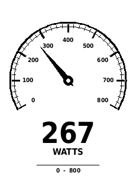

# Garmin Power Dial

A monochrome analogue cycling power data field for the **Garmin Edge 130 Plus**, written in Monkey C for Garmin Connect IQ.

This repository preserves Thomas's existing app source, application ID, resources, and Windows build/install helpers. The initial import changes project documentation and repository housekeeping, not the app's behaviour.



*Original project preview; not a screenshot of a validation run.*

## Features

- 240-degree dial with a 0–800 W needle scale.
- Major ticks every 100 W and minor ticks every 20 W.
- Damped needle movement with a live digital power readout.
- Full gauge when field height is at least 220 pixels; compact gauge otherwise.
- Missing power displays `--`; the needle decays towards zero.
- Needle position is clamped to the scale; the digital readout retains the supplied power value.

## Project layout

```text
source/                   App entry point and gauge rendering
resources/                App name and launcher icon
manifest.xml              App identity, Edge 130 Plus target, minimum API 3.2.0
monkey.jungle              Connect IQ build configuration
BUILD_AND_INSTALL.cmd     Windows launcher
BUILD_AND_INSTALL.ps1     Existing compiler discovery and USB install helper
PREVIEW.png               Original design preview
docs/VALIDATION.md         Import checks and device review checklist
.github/                  Pull request template
```

## Build

Install the [Garmin Connect IQ SDK](https://developer.garmin.com/connect-iq/sdk/), its required Java runtime, and the **Edge 130 Plus** device files using SDK Manager. Make the SDK's `bin` directory available on your command path, or use the compiler's full path.

You also need a local developer signing key. **The key is deliberately not stored in Git.** Thomas should keep using his original `developer_key.der` for continuity, with a secure backup outside the repository. Other developers must supply their own key. Do not commit keys or send them in pull requests.

From the project root, in PowerShell:

```powershell
New-Item -ItemType Directory -Force build | Out-Null
monkeyc -d edge130plus -f monkey.jungle -o build/AnalogPowerDial.prg -y "C:\path\to\developer_key.der"
```

This builds the app without installing it. Output goes into the ignored `build/` folder.

## Install on the device

For the existing one-click Windows workflow, place your signing key at `developer_key.der` in the project root (ignored by Git), connect the Edge by USB, and run `BUILD_AND_INSTALL.cmd`.

The helper builds the app and copies it to the first detected drive containing `GARMIN/APPS`, replacing an existing `AnalogPowerDial.prg` there. Connect only the intended Garmin device. If no device is found, it leaves the compiled file in `build/` for manual copying.

After copying, safely eject/disconnect the Edge and add **Analog Power Dial** as a Connect IQ field on a cycling data screen. Use a tall field layout to see the full dial. Power readings require an appropriate power source supplying activity power data.

## Making changes

Use **branch → change → commit → push → pull request → review → merge**. See [CONTRIBUTING.md](CONTRIBUTING.md) for commands and what each step means. The first import is proposed on `feature/import-power-dial`; `main` initially contains only the repository's starting commit until that pull request is merged.

## Validation and scope

See [validation notes](docs/VALIDATION.md) for actual checks and the remaining simulator/device checklist. A successful compiler run does not establish runtime or hardware correctness. There is no automated CI build configured yet.

Only the Edge 130 Plus is declared in the manifest. No other Garmin devices are claimed to be supported. No open-source licence has been selected; repository visibility does not grant reuse rights.
